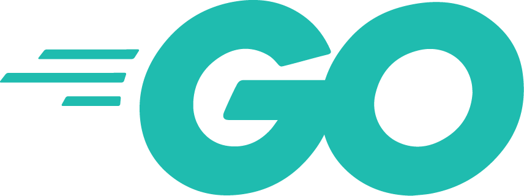
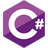

## Hi there 👋

I'm Thomas, a French student in computer science. Passionate about computers in general.  
Currently learning 

## Things I already use

  
Note: this list isn't exhaustive, it only represent things I've already spend some (or in some case a lot of) time on.  
Images are from [here](https://github.com/abranhe/programming-languages-logos), [here](https://icones8.fr/) or from the linked website.

## Where to reach me ?

Twitter: [@Samoth690](https://twitter.com/Samoth690)  
LinkedIn: [Thomas V.](https://linkedin.com/in/thomas-violent-342a25194)

## Stats (for fun)

